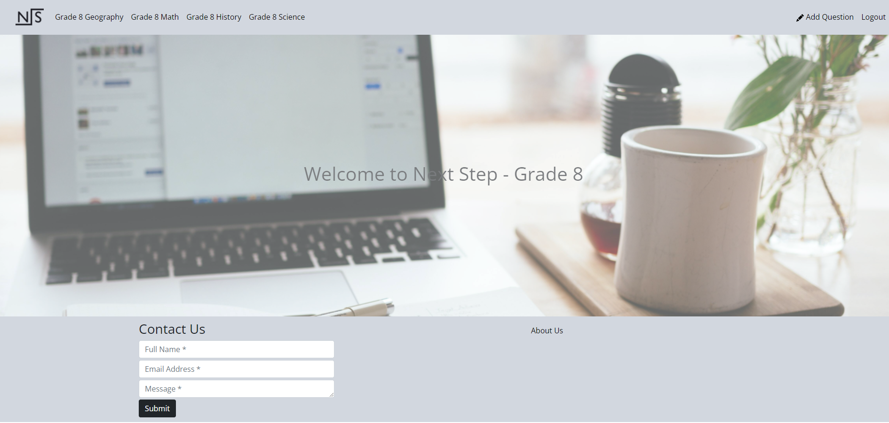

# Next Step

## Table of Contents
* [Project Description](#Project-Description)
* [User Story](#User-Story)
* [Acceptance Criteria](#Acceptance-Criteria)
* [Technologies Used](#Technologies-Used)
* [Screenshot](#Screenshot)
* [Submition Requirements](#Submition-Requirements)

## Project Description
The purpose of Next Step is to create a supplemental learning platform where youth at various elementary, middle and high school levels can better prepare themselves in their courses and maximize their learning.

## User Story
* AS an ELEMENTARY SCHOOL STUDENT
  * I WANT to have access to learning materials for various courses
  * SO THAT I can learn more and practice for upcoming school tests and assignments.
  
## Acceptance Criteria
* GIVEN my desire to search for learning resources
* WHEN I view the homepage of the application
  * THEN I can either sign in or sign up as a student
* WHEN I sign up
  * THEN I must complete the form
* WHEN I am taken to my account page
  * THEN I can search for learning material by course category
* WHEN I select a course
  * THEN I am taken to it's associated questions
* WHEN I select a question
  * THEN I can view the answer to that question

## Technologies Used
* Dependencies include:
     "@apollo/react-hooks": "^3.1.5",
      "@stripe/stripe-js": "^1.20.3",
      "@testing-library/jest-dom": "^4.2.4",
      "@testing-library/react": "^9.5.0",
      "@testing-library/user-event": "^7.2.1",
      "apollo-boost": "^0.4.9",
      "apollo-link-context": "^1.0.20",
      "bootstrap": "^5.1.1",
      "graphql": "^14.7.0",
      "graphql-tag": "^2.12.5",
      "jwt-decode": "^2.2.0",
      "react": "^16.14.0",
      "react-bootstrap": "^2.0.0-rc.1",
      "react-dom": "^16.14.0",
      "react-icons": "^4.3.1",
      "react-router": "^6.0.2",
      "react-router-dom": "^4.3.1",
      "react-scripts": "^3.4.1",
      "react-transition-group": "^4.4.2",
      "styled-components": "^5.3.3"
* Deployed via: Heroku

## Screenshot

## Submition Requirements
* URL of the deployed application: https://next-setp-uoft-project3.herokuapp.com/
* URL of the GitHub repository: https://github.com/BootcampProject/next-step.git)
